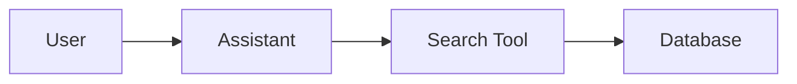

# Documentation Maintenance Guide

This project uses **MkDocs with Material theme** for documentation.

## Quick Commands

```bash
# Development mode - runs app + auto-rebuilds docs on changes
uv run working_files/dev.py
# This watches docs/ and backend/ and rebuilds automatically!
# Visit http://localhost:7860/docs to see the docs in the app

# Serve docs separately with live reload (for writing docs)
uv run mkdocs serve
# Visit http://127.0.0.1:8000 for instant preview

# Build static docs manually
uv run mkdocs build
```

## Documentation Structure

```
docs/
├── index.md                    # Homepage
├── user-guide/                 # User documentation
│   ├── overview.md
│   ├── assistant.md
│   └── search.md
├── developer-guide/            # Developer documentation
│   ├── getting-started.md
│   ├── architecture.md
│   └── contributing.md
└── api/                        # Auto-generated API docs
    ├── index.md
    ├── assistant.md
    ├── assistanttools.md
    ├── searching.md
    ├── storage.md
    └── version.md
```

## Writing Documentation

### Markdown Files

All docs are written in Markdown with extensions:

- **Code blocks** with syntax highlighting
- **Admonitions** for notes, tips, warnings
- **Tables** for structured data
- **Mermaid diagrams** for visualizations

### Adding Mermaid Diagrams

Just use mermaid code blocks:

````markdown

````

The diagram will render automatically!

### API Documentation

API docs are **automatically generated** from Python docstrings using mkdocstrings.

To update API docs:

1. Write good docstrings in your Python code (Google style)
2. Run `uv run mkdocs build`
3. The API reference updates automatically!

Example docstring:

```python
def search_documents(query: str, max_results: int = 10) -> list[Document]:
    """Search for documents matching the query.
    
    Args:
        query: The search query string
        max_results: Maximum number of results to return
        
    Returns:
        List of matching Document objects
        
    Example:
        >>> results = search_documents("runway safety", max_results=5)
        >>> print(len(results))
        5
    """
    pass
```

### Admonitions (Callouts)

Use admonitions for special notes:

```markdown
!!! note "Optional Title"
    This is a note with an optional title.

!!! tip
    This is a helpful tip!

!!! warning
    This is a warning!

!!! example
    This is an example!
```

## Configuration

All configuration is in `mkdocs.yml`:

- **Navigation**: Update the `nav:` section
- **Theme**: Material theme settings
- **Plugins**: mkdocstrings configuration
- **Extensions**: Markdown extensions (Mermaid, etc.)

## Accessing Docs in the App

The docs are automatically mounted at `/docs` when the app runs:

- Local: `http://localhost:7860/docs`
- Production: `https://your-domain.com/docs`

A link is also in the footer of every page.

## Building for Production

The docs are built to the `site/` directory (gitignored).

In production, the app serves these static files automatically from the `/docs` endpoint.

To rebuild before deployment:

```bash
uv run mkdocs build
```

## Tips for Documentation

1. **Keep it updated**: Update docs when you change code
2. **Use examples**: Show code examples where possible
3. **Add diagrams**: Mermaid diagrams help explain architecture
4. **Test locally**: Run `mkdocs serve` to preview before committing
5. **Write good docstrings**: They become API documentation automatically!

## Troubleshooting

**Docs not updating?**

Clear the build cache:

```bash
rm -rf site/
uv run mkdocs build
```

**Module not found errors?**

Make sure you're in the project root and using `uv run`:

```bash
cd /home/devuser/code/TAIC_smart_assistant
uv run mkdocs build
```

**Mermaid diagrams not rendering?**

Check the syntax. Visit https://mermaid.js.org/ for examples.
