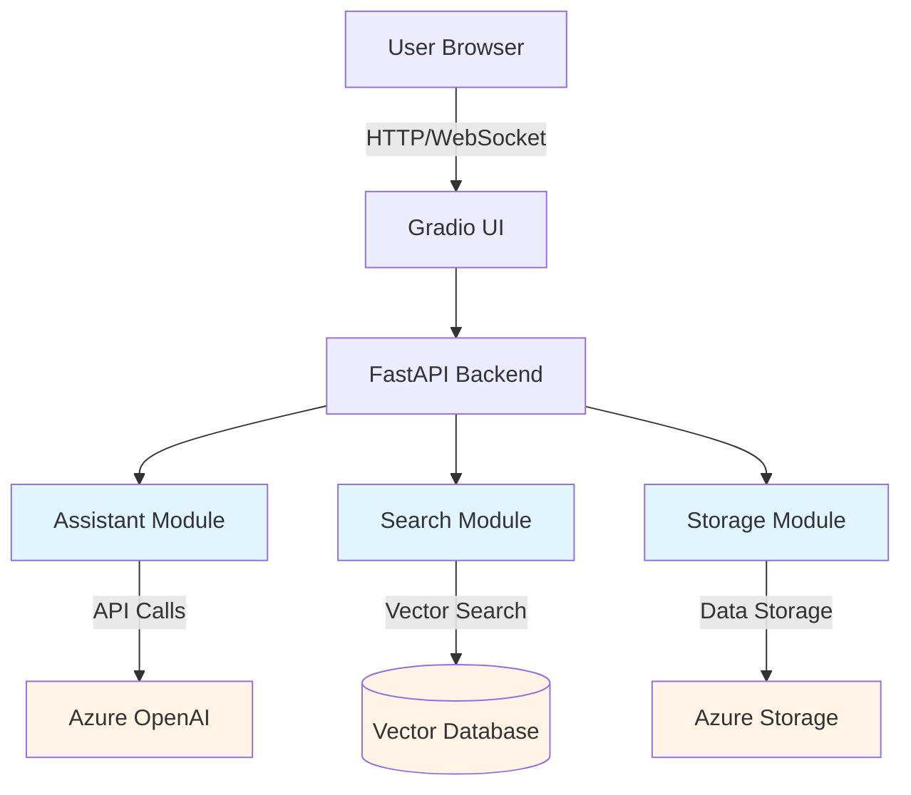
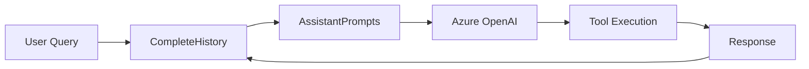
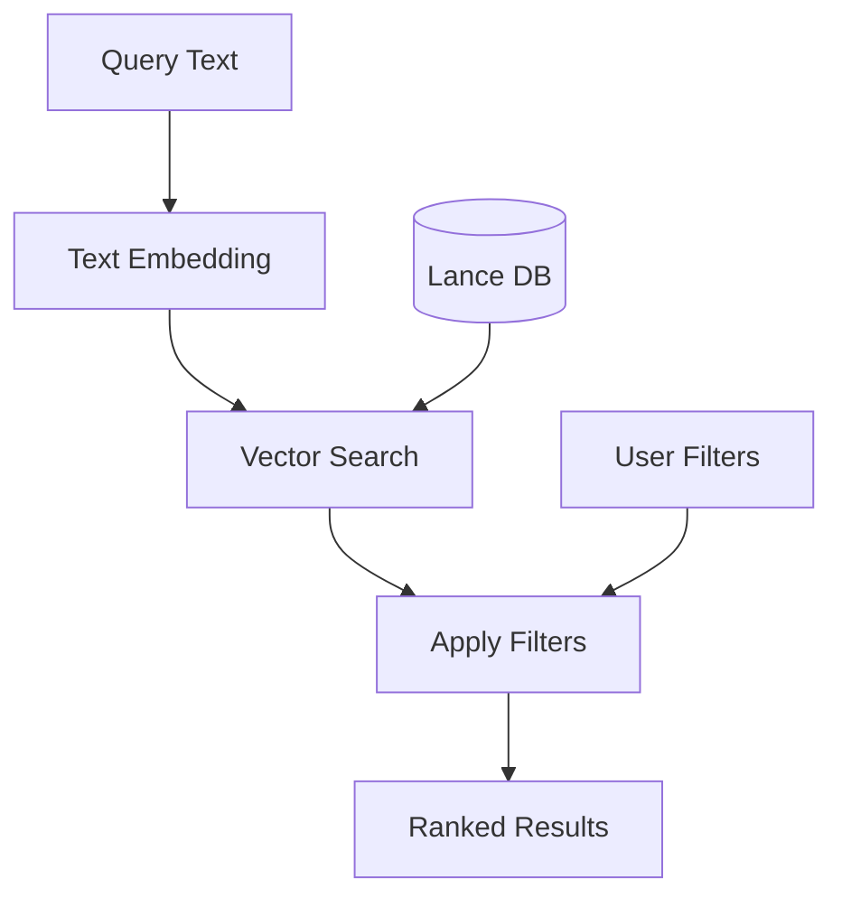
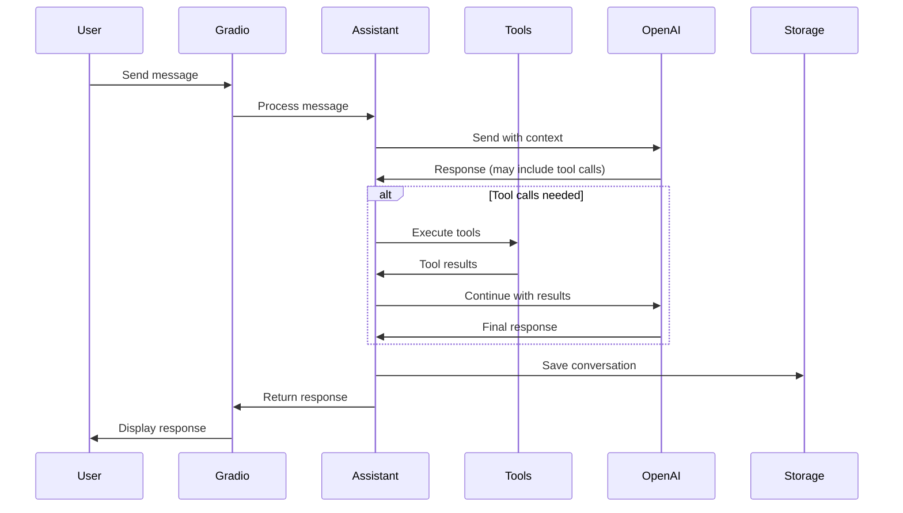
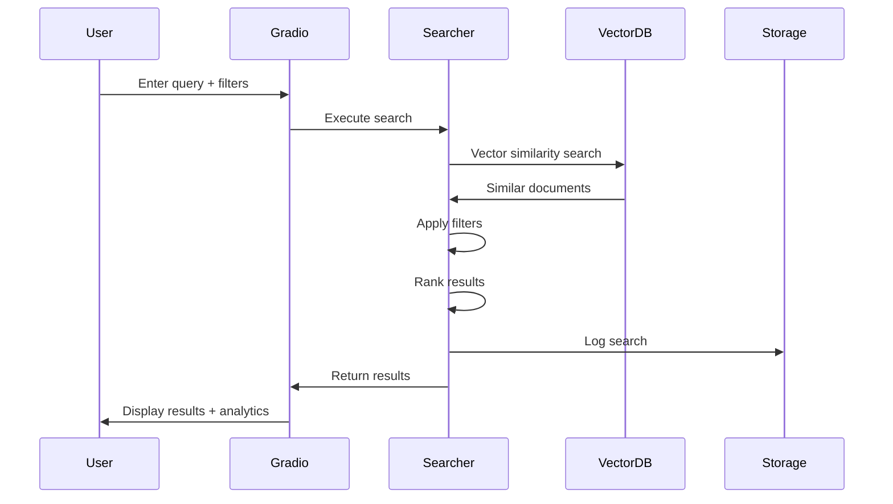
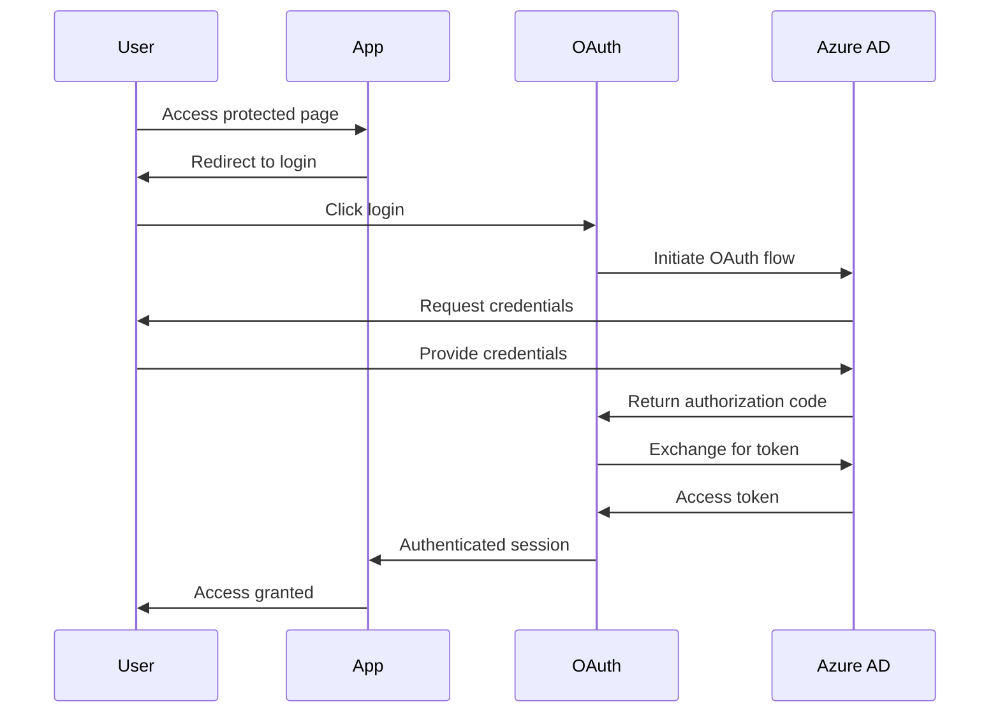

# Architecture

This document describes the high-level architecture of TAIC Smart Tools.

## System Overview

## Components

### Frontend (Gradio)

The user interface is built with Gradio, providing:

- **Chat Interface**: For the Smart Assistant
- **Search Interface**: For Knowledge Search
- **Authentication UI**: OAuth integration

Key features:

- Real-time updates via WebSocket
- Responsive design
- Built-in authentication flows

### Backend (FastAPI)

FastAPI handles:

- API endpoints
- WebSocket connections for chat
- Session management
- OAuth authentication
- Static file serving

### Core Modules

#### Assistant (`backend/Assistant.py`)

Manages AI conversation logic:

**Key Classes:**

- `CompleteHistory`: Manages conversation history
- `AssistantPrompts`: Generates system prompts
- `Assistant`: Main orchestrator for AI interactions

#### AssistantTools (`backend/AssistantTools.py`)

Implements tools the assistant can use:

- `SearchTool`: Searches the knowledge base
- `ReadReportTool`: Retrieves full report content
- `ReasoningTool`: Extended thinking capability
- `DocumentationTool`: Accesses internal documentation

#### Searching (`backend/Searching.py`)

Handles vector-based semantic search:

**Key Classes:**

- `Searcher`: Main search interface
- `AzureAITextEmbeddingFunction`: Converts text to embeddings
- `SearchParams`: Search configuration
- `GraphMaker`: Creates analytics visualizations

#### Storage (`backend/Storage.py`)

Manages data persistence:

**Blob Storage:**

- `ConversationBlobStore`: Stores conversation content
- `KnowledgeSearchBlobStore`: Stores search sessions

**Table Storage:**

- `ConversationMetadataStore`: Conversation metadata
- `KnowledgeSearchMetadataStore`: Search metadata

#### Version (`backend/Version.py`)

Handles version management and compatibility checking.

## Data Flow

### Chat Interaction

### Knowledge Search

## Technology Stack

### Core Technologies

- **Python 3.10-3.12**: Application runtime
- **Gradio**: UI framework
- **FastAPI**: API framework
- **Uvicorn**: ASGI server

### AI/ML

- **Azure OpenAI**: Language model
- **LanceDB**: Vector database
- **Azure AI Embeddings**: Text embeddings

### Storage

- **Azure Blob Storage**: Conversation/search content
- **Azure Table Storage**: Metadata

### Development

- **pytest**: Testing framework
- **pre-commit**: Code quality hooks
- **uv**: Package management
- **MkDocs**: Documentation

## Authentication Flow

## Deployment Architecture

The application is deployed as a containerized service:

- Docker container with all dependencies
- Environment-based configuration
- Azure-hosted services for storage and AI
- OAuth integration with organizational Azure AD

## Performance Considerations

### Vector Search Optimization

- LanceDB provides efficient similarity search
- Indices are pre-built and loaded at startup
- Filters applied post-retrieval for flexibility

### Conversation Management

- Conversations stored as JSON blobs
- Metadata in Table Storage for fast queries
- Lazy loading of conversation content

### Caching

- Static assets served with caching headers
- Vector embeddings cached in memory
- Search results not cached (always fresh)

## Security

### Authentication

- OAuth 2.0 with Azure AD
- Session-based authentication
- No passwords stored locally

### Data Protection

- All communication over HTTPS
- Azure Storage encryption at rest
- API keys stored in environment variables

### Authorization

- User identity tracked in all operations
- Conversation isolation by user
- Search logs include user attribution

## Scalability

### Current Limitations

- Single instance deployment
- Vector DB loaded in memory
- No horizontal scaling

### Future Improvements

- Distributed vector search
- Redis for session management
- Load balancing across instances
- CDN for static assets
