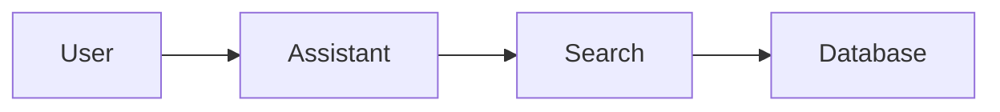

# Contributing

See [Getting Started](getting-started.md) for setup instructions.

## Workflow

1. Create feature branch: `git checkout -b feature/your-name`
2. Make changes, add tests, update docs
3. Test: `uv run pytest && uv run pre-commit run --all-files`
4. Create PR with prefix: `major:`, `minor:`, or `patch:`
5. Squash-and-merge after review

## Documentation

Documentation is built with **MkDocs + Material theme**.

```bash
# Dev mode (auto-rebuild app + docs)
uv run working_files/dev.py

# Preview only (live reload)
uv run mkdocs serve

# Build static site
uv run mkdocs build
```

**Writing docs:**
- User guides: `docs/user-guide/`  
- Developer guides: `docs/developer-guide/`  
- API reference: auto-generated from docstrings  
- Use [Google-style docstrings](https://google.github.io/styleguide/pyguide.html#38-comments-and-docstrings) for all public APIs  
- Add [Mermaid diagrams](https://mermaid.js.org/) for visualizations  
- Use callout boxes (see below) for notes and warnings  
- Update `mkdocs.yml` nav when adding pages  

**Docstring example ([Google style](https://sphinxcontrib-napoleon.readthedocs.io/en/latest/example_google.html)):**
```python
def search(query: str, max_results: int = 10) -> list[Document]:
    """Search for documents matching the query.

    Args:
        query: The search query string.
        max_results: Maximum number of results to return.

    Returns:
        List of matching Document objects.
    """
```

**Mermaid diagrams ([syntax reference](https://mermaid.js.org/intro/)):**
````markdown

````

**Callout boxes ([Material docs](https://squidfunk.github.io/mkdocs-material/reference/admonitions/)):**
```markdown
!!! note
    This is a note callout.

!!! warning
    This is a warning callout.

!!! tip
    This is a tip callout.

!!! example "Custom Title"
    This callout has a custom title.
```

## Continuous Integration (CI) Pipeline

**Version management:** Semantic versioning via PR prefix  
- `major:` → Breaking changes  
- `minor:` → New features  
- `patch:` → Bug fixes  

**CI (GitHub Actions):**  
- Runs on all PRs and pushes to `main`  
- Linting: Ruff checks code style  
- Testing: pytest with mocks and real services  
- Auto-versioning: Updates version on merge to main  

**Required secrets:**  
- `AZURE_STORAGE_SAS_TOKEN` - Access to test config  
- `AZURE_STORAGE_ACCOUNT_NAME` - Storage account name  


