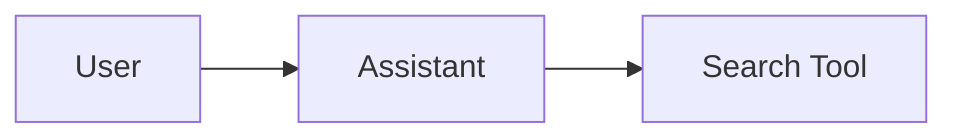

# Contributing

Thank you for your interest in contributing to TAIC Smart Tools! This guide will help you get started.

## Development Setup

Before contributing, ensure you have completed the [Getting Started](getting-started.md) guide.

## Contribution Workflow

### 1. Create a Feature Branch

For TAIC internal developers, create branches directly from the repository:

```bash
# Fetch latest changes
git fetch origin
git checkout main
git pull

# Create feature branch
git checkout -b feature/your-feature-name
```

Work items in Azure DevOps can automatically create branches.

### 2. Make Your Changes

Follow these guidelines:

- Write clear, descriptive commit messages
- Keep commits focused and atomic
- Add tests for new functionality
- Update documentation as needed
- Follow the existing code style

### 3. Test Your Changes

```bash
# Run tests
uv run pytest

# Run with coverage
uv run pytest --cov=backend --cov-report=term-missing

# Run pre-commit checks
uv run pre-commit run --all-files
```

### 4. Create a Pull Request

1. Push your branch to GitHub
2. Create a pull request with appropriate prefix:
   - `major:` - Breaking changes (e.g., API changes)
   - `minor:` - New features (backward compatible)
   - `patch:` - Bug fixes and minor improvements

3. Fill out the PR template with:
   - Description of changes
   - Related work items
   - Testing performed
   - Screenshots (if UI changes)

### 5. Code Review

- Address reviewer feedback
- Keep the discussion focused
- Update the PR as needed

### 6. Merge

- Use **squash-and-merge** to maintain clean history
- Delete the feature branch after merging

## Code Style

### Python

- Follow PEP 8 style guide
- Use type hints where possible
- Maximum line length: 88 characters (Black default)
- Use meaningful variable and function names

Example:

```python
def search_documents(
    query: str,
    filters: dict[str, Any],
    max_results: int = 10,
) -> list[Document]:
    """Search for documents matching the query.

    Args:
        query: The search query string.
        filters: Dictionary of filter criteria.
        max_results: Maximum number of results to return.

    Returns:
        List of matching Document objects.
    """
    # Implementation
    pass
```

### Documentation (MkDocs)

- Keep docs updated when code changes
- Use Google-style docstrings for all public APIs
- Add examples when it improves clarity

Quick commands:

```bash
# Dev mode with auto-rebuild (app + docs)
uv run working_files/dev.py

# Live docs preview only
uv run mkdocs serve

# Static build (used by /documentation in the app)
uv run mkdocs build
```

Docs structure:

```
docs/
├── index.md
├── user-guide/
├── developer-guide/
└── api/            # Auto-generated from docstrings
```

Mermaid diagrams:

````markdown

````

Docstrings are enforced by Ruff (Google convention) in pre-commit and CI.

## Testing

### Writing Tests

- Place tests in the `tests/` directory
- Name test files `test_*.py`
- Name test functions `test_*`
- Use fixtures for common setup
- Mock external services (Azure, OpenAI)

Example:

```python
import pytest
from backend.Storage import ConversationMetadataStore

def test_create_conversation(mock_table_client):
    """Test that conversations are created with correct metadata."""
    store = ConversationMetadataStore(mock_table_client, "test_table")
    
    metadata = store.create_conversation(
        user_id="test_user",
        title="Test Conversation"
    )
    
    assert metadata["user_id"] == "test_user"
    assert metadata["title"] == "Test Conversation"
    assert "conversation_id" in metadata
```

### Running Tests

```bash
# All tests
uv run pytest

# Specific test file
uv run pytest tests/test_assistant.py

# Specific test
uv run pytest tests/test_assistant.py::test_create_message

# With coverage
uv run pytest --cov=backend --cov-report=html
```

## Version Management

The project uses semantic versioning (MAJOR.MINOR.PATCH):

- **MAJOR**: Breaking changes
- **MINOR**: New features (backward compatible)
- **PATCH**: Bug fixes and minor improvements

Version is managed automatically through PR prefixes:

- `major:` increments major version
- `minor:` increments minor version
- `patch:` increments patch version

The version is stored in:

- `pyproject.toml`
- `backend/Version.py`
- `mkdocs.yml`

## Common Tasks

### Adding a New Feature

1. Create feature branch
2. Implement the feature
3. Add tests
4. Update documentation
5. Create PR with `minor:` prefix

### Fixing a Bug

1. Create bug fix branch
2. Write a test that reproduces the bug
3. Fix the bug
4. Verify test passes
5. Create PR with `patch:` prefix

### Updating Dependencies

```bash
# Update all dependencies
uv sync --upgrade

# Add new dependency
uv add package-name

# Add dev dependency
uv add --dev package-name
```

After updating dependencies, test thoroughly and update the lock file.

## Documentation Access

- Local app docs: `http://localhost:7860/docs`
- Live preview: `http://127.0.0.1:8000`

### Adding Documentation

- User guides go in `docs/user-guide/`
- Developer guides go in `docs/developer-guide/`
- API reference is auto-generated from docstrings

Update `mkdocs.yml` navigation if adding new pages.

## Pre-commit Hooks

The project uses pre-commit hooks to ensure code quality:

- **Black**: Code formatting
- **Ruff**: Linting
- **MyPy**: Type checking
- **Trailing whitespace**: Removes trailing spaces

Install hooks:

```bash
uv run pre-commit install
```

Run manually:

```bash
uv run pre-commit run --all-files
```

## Continuous Integration

GitHub Actions automatically:

- Runs tests on all PRs
- Checks code style
- Verifies builds
- Updates version on merge to main

## Need Help?

- Check existing issues on GitHub
- Review the [Architecture Guide](architecture.md)
- Ask in pull request discussions
- Contact the maintainers

## Code of Conduct

- Be respectful and professional
- Focus on constructive feedback
- Help others learn and grow
- Keep discussions on-topic

Thank you for contributing to TAIC Smart Tools! 🚀
